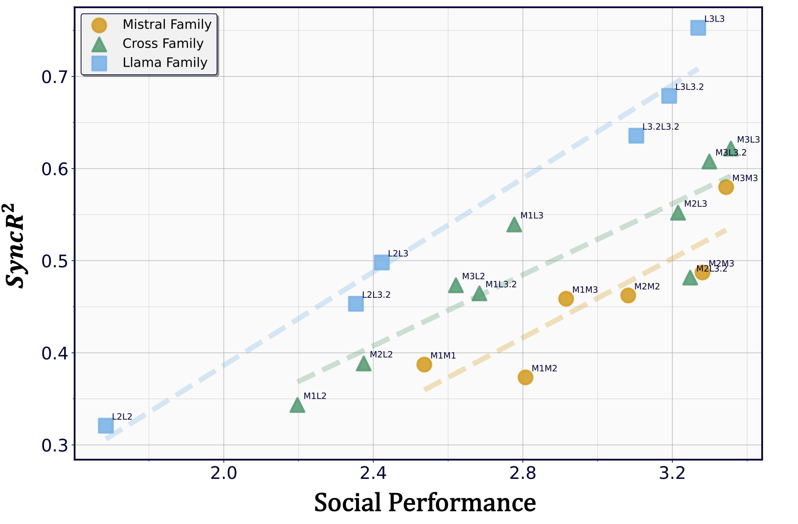

# 🧠 Neural Synchrony Between Socially Interacting Language Models 

This repository contains the code accompanying the paper **"Neural Synchrony Between Socially Interacting Language Models"**.



It shows that neural synchrony, as measured by *predictive abilities between the neural representations* of interacting language models, is strongly correlated with their collective social performances.

## ⚙️ Requirements

- Install relevant packages:
    - run `pip install -r requirements.txt`.
- Please set your local model paths in `model_paths.json`.

## 🗣️ Extractng Neural Representations While Running Social Simulation
```
sh bash/simulate_and_save_states.sh
```

The collected representations and social simulation records will be saved in `sotopia_results/`.

## 🔄 Training and Evaluating Affine Transformations Between Neural Representations
```
sh bash/train_affine_transformation.sh
```

The results will be stored in a local folder `./affine_transformation`.


## 💬 Neural Synchrony As Indicator For Social Performances

Before running the script for evaluation, make sure to launch vLLM serving gpt-oss-120b locally.
You can follow the setup instructions in [this guide](https://cookbook.openai.com/articles/gpt-oss/run-vllm). If needed, you may customize the port in the script.

Evaluating social performances with gpt-oss-120b:

```
python evaluate_with_oss.py
```

Then, for calculating neural synchrony and plotting the correlation figure, run `data_analysis.py` in `playground/` for result analysis and figures 📊.


## ⏱️ Neural Synchrony Captures Social and Temporal Dynamics of Interaction

To get control conditions, run:

```
sh bash/without_genuine_interaction.sh 
```
