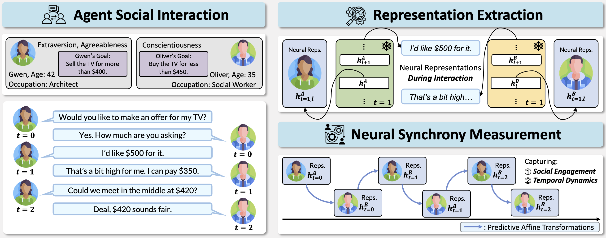

# 🧠 Neural Synchrony Between Socially Interacting Language Models

> This repository contains the code accompanying the paper **"Neural Synchrony Between Socially Interacting Language Models"**. 
It shows that neural synchrony, as measured by *predictive performances between the neural representations* of interacting language models, is strongly correlated with their collective social performances.

<p align="center">
  
</p>

---

<details>
<summary><strong>📑 Table of Contents</strong></summary>

1. [📦 Requirements](#requirements)
2. [🧠 Extracting Neural Representations](#extracting-neural-representations-while-running-social-simulation)
3. [🔁 Training Affine Transformations](#training-and-evaluating-affine-transformations-between-neural-representations)
4. [📊 Social Performance Evaluation](#neural-synchrony-as-indicator-for-social-performances)
5. [⏱️ Social and Temporal Dynamics](#neural-synchrony-captures-social-and-temporal-dynamics-of-interaction)

</details>

---

## Requirements

**Installation Steps:**

1. **Install dependencies:**
   ```bash
   pip install -r requirements.txt
   ```

2. **Configure model paths:**
   - Set your local model paths in `model_paths.json`

---

## Extracting Neural Representations While Running Social Simulation

**Run the simulation:**

```bash
sh bash/simulate_and_save_states.sh
```

- The collected representations and social simulation records will be saved in `sotopia_results/`.

---

## Training and Evaluating Affine Transformations Between Neural Representations

```bash
sh bash/train_affine_transformation.sh
```

- Results will be stored in `./affine_transformation`.

---

## Neural Synchrony As Indicator For Social Performances

> [!IMPORTANT]
> Before running the evaluation script, make sure to launch vLLM serving gpt-oss-120b locally.  
> Follow the setup instructions in [this guide](https://cookbook.openai.com/articles/gpt-oss/run-vllm). You may customize the port in the script if needed.

To evaluate social performances with gpt-oss-120b:

```bash
python evaluate_with_oss.py
```

To analyze results and generate figures, run `playground/data_analysis.py` for result analysis and figures 📊.

---

## Neural Synchrony Captures Social and Temporal Dynamics of Interaction

**Generate control conditions:**

```bash
sh bash/without_genuine_interaction.sh
```

Then see `playground/data_analysis.py` for result analysis and figures 📊.

